# The POC Guide

> Everything needed to evaluate Vision One File Security on EKS: deploy the stack, scan your first files, connect your own application in Java, and tear it all down cleanly. One API key and about 30 minutes gets you a running scanner.

## Contents

**Part I — Deploy**

1. [What you're evaluating](#1-what-youre-evaluating)
2. [Prerequisites](#2-prerequisites)
3. [Pick your deployment mode](#3-pick-your-deployment-mode)
4. [Deploy the stack](#4-deploy-the-stack)
5. [Your first scans](#5-your-first-scans)
6. [Inside the scanning app](#6-inside-the-scanning-app)
7. [What the bastion does](#7-what-the-bastion-does)

**Part II — Integrate**

8. [Find your endpoint](#8-find-your-endpoint)
9. [Java: add the SDK](#9-java-add-the-sdk)
10. [Java: open the connection](#10-java-open-the-connection)
11. [Java: reuse the connection](#11-java-reuse-the-connection)
12. [Java: submit scans](#12-java-submit-scans)
13. [Read the response](#13-read-the-response)
14. [When things go wrong](#14-when-things-go-wrong)
15. [Complete working example](#15-complete-working-example)

**Part III — Operate & Wrap Up**

16. [Tune the scan policy](#16-tune-the-scan-policy)
17. [Scaling expectations](#17-scaling-expectations)
18. [Troubleshooting](#18-troubleshooting)
19. [Teardown](#19-teardown)
20. [Quick reference](#20-quick-reference)
21. [References](#21-references)


---

# Part I — Deploy


## 1. What you're evaluating

A single CloudFormation template stands up an EKS cluster running the **TrendAI Vision One File Security scanner** — installed from the official Helm chart, scaled by the chart's own autoscaler, in the configuration TrendAI documents and supports. Nothing custom sits between you and the product you're evaluating.

```text
[Your files (S3 upload, or your own app)] ──▶ [V1FS Scanner on EKS (official chart · chart HPA)] ──▶ [Verdicts (clean / quarantine + tags)]
```

Files are scanned **inside your VPC** — the bytes never leave your account. Scan metadata (verdicts, threat names) reports to your Vision One console. Around the scanner core, optional modules — a complete S3 scanning pipeline, a deep-analysis review pipeline, an external endpoint — turn on and off with template parameters.


### The architecture in one picture

Every resource the stack creates, and how a scan flows through them. Node color shows which parameter creates each piece — a default deploy builds the green (core) and amber (scanner-app) items; purple, blue, and red switch on with their modes.

```mermaid
flowchart TB
  classDef core stroke:#1D8102,stroke-width:3px
  classDef app stroke:#906806,stroke-width:3px
  classDef review stroke:#8C4FFF,stroke-width:3px
  classDef endpoint stroke:#0073BB,stroke-width:3px
  classDef existing stroke:#D13212,stroke-width:3px

  subgraph REGION["AWS account — region services"]
    S3A["S3 × 3<br/>ingest · clean · quarantine"]:::app
    S3R["S3 review bucket"]:::review
    SQSA["SQS + DLQ<br/>scan queue pair"]:::app
    SQSR["Review SQS + DLQ"]:::review
    LDLQ["Lambda: DLQ remediation"]:::app
    LRDLQ["Lambda: review DLQ"]:::review
    LEB["EventBridge rule + merge Lambda<br/>wires YOUR bucket"]:::existing
    LCLEAN["Lambda: pre-delete cleanup"]:::core
    ECR["ECR repository<br/>git-SHA image tags"]:::app
    SEC["Secrets Manager<br/>API key (+ optional token)"]:::core
    SSMP["SSM parameter<br/>/&lt;stack&gt;/scanner-endpoint"]:::endpoint
    IAM["IAM roles + Pod Identity<br/>~12 scoped roles"]:::core
    CW["CloudWatch<br/>dashboard · alarms + SNS · audit logs"]:::app
  end

  subgraph VPC["VPC 10.2.0.0/16 — created by the stack, or yours (ExistingVpcId)"]
    NET["IGW · 2× NAT + EIP · 2 public + 2 private subnets · route tables · flow logs"]:::core
    SGS["Security groups<br/>bastion SG: no inbound (SSM-only)"]:::core
    BAST["Bastion t3.medium<br/>runs bootstrap.sh"]:::core
    EFS["EFS + 2 mount targets<br/>scanner scratch space"]:::core
    LB["Internal NLB or ALB<br/>gRPC :50051 / TLS :443"]:::endpoint

    subgraph EKS["EKS cluster — managed node group r7i.xlarge × 2–8, Cluster Autoscaler"]
      V1FS["V1FS scanner<br/>chart HPA 1–10"]:::core
      SUP["V1FS support pods<br/>management · database · cache · communicator"]:::core
      RV["V1FS rv release<br/>no decompression limits · HPA 1–3"]:::review
      APP["scanner-app<br/>KEDA 1–20 on queue depth"]:::app
      RAPP["review-scanner-app<br/>KEDA 1–5 always-warm"]:::review
      SYS["System: Cluster Autoscaler · LB controller · metrics-server · Pod Identity agent · EBS/EFS CSI · KEDA operator"]:::core
    end
  end

  S3A -- "S3 events" --> SQSA
  SQSA -- "long-poll" --> APP
  APP -- "gRPC :50051" --> V1FS
  LB --> V1FS
  S3R --> SQSR --> RAPP -- "gRPC" --> RV
  BAST -. "provisions" .-> EKS
```



| Edge color | Created by |
|---|---|
| 🟢 green | always (core) |
| 🟡 amber | `DeployScannerApp` (default on) |
| 🟣 purple | `DeployReviewPipeline` |
| 🔵 blue | `ScannerEndpointMode` |
| 🔴 red | `ExistingIngestBucket` |


## 2. Prerequisites

| You need | Details |
|---|---|
| **One Vision One API key** | Console → *Administration → API Keys → Add API Key*, with the **"Run file scan via SDK"** permission. That's the only credential — the scanner's registration token is fetched automatically at deploy time using this key. |
| **An AWS account** | Admin-level access in one region. The stack idles at roughly 10 vCPU — inside default compute quotas. |
| **Quota headroom** | Each stack uses **2 Elastic IPs and 1 VPC**. Default quotas (5 each) support two concurrent stacks — and a *deleting* stack still holds its quota until deletion completes. Deploy sequentially, or raise the quotas. |
| *ALB endpoint only* | An ACM certificate and a DNS name you control. Skip unless you specifically want TLS termination at an ALB — the default internal NLB needs neither. |
| *Existing VPC only* | By default the stack creates its own network. To deploy into a VPC you already manage, set `ExistingVpcId` + CIDR + two private subnets + a bastion subnet. Your VPC needs DNS enabled, outbound internet from the private subnets (the scanner must reach Vision One), and the `kubernetes.io/role/internal-elb=1` tag on the private subnets. The bastion works from a private subnet — it's SSM-only. |

> [!NOTE]
> **Non-US Vision One tenant?** Set the `VisionOneApiEndpoint` parameter to your regional API host. The default is the US host, `https://api.xdr.trendmicro.com`.


## 3. Pick your deployment mode

Four parameter combinations cover the common evaluation goals. Everything else defaults sensibly.

| Your goal | Parameters | What you get |
|---|---|---|
| **See the full pipeline work** (recommended first run) | *all defaults* | New ingest bucket → SQS → scanning app → clean/quarantine buckets. Drop a file in, watch the verdict land. |
| **I have my own scanning app** | `DeployScannerApp=false` | Just the scanner plus a gRPC endpoint address. No buckets, queues, or pipeline. Connect via the SDK — that's Part II. |
| **Scan a bucket I already own** | `ExistingIngestBucket=` | Your bucket is wired via EventBridge — its existing notification configuration is preserved, and your objects are *tagged* with verdicts, never deleted or moved. |
| **Deep archive analysis** | `DeployReviewPipeline=true` | Adds a second scanner with no decompression limits that re-scans archives too deep/large for the main policy before the final verdict. |

Modes combine (e.g. existing bucket + review pipeline). Invalid combinations are rejected at stack creation by built-in rules.


## 4. Deploy the stack

Deploy from the **AWS Console** (click-by-click, below) or the **AWS CLI** (automation — end of this section). Both produce the same stack.

**Before you start:** have your Vision One API key ready (§2) and decide your deployment mode (§3). The default mode — the full scanning pipeline — needs only the API key.

### Step 1 — Get the template

Download `eks-v1fs.yaml` from the [**eks-v1fs repository**](https://github.com/arcaniusdev/eks-v1fs) — ideally from the [latest tagged release](https://github.com/arcaniusdev/eks-v1fs/tags), so the components the bastion pulls at deploy time match the template you launch. That's the only file you need. (Direct link to the current release template: `https://raw.githubusercontent.com/arcaniusdev/eks-v1fs/v1.0.1/eks-v1fs.yaml`.)

### Step 2 — Start the Create stack wizard

1. Open the **CloudFormation console** → **Create stack** → **With new resources (standard)**.
2. Under **Specify template**, choose **Upload a template file** → **Choose file** → select `eks-v1fs.yaml` → **Next**. (The console stages it to S3 for you — no bucket to create.)

> [!NOTE]
> Prefer hosting it yourself? Upload `eks-v1fs.yaml` to any S3 bucket and choose **Amazon S3 URL** instead. This is also what the CLI path at the end of this section requires, since the template is larger than CloudFormation's 51 KB inline limit.

### Step 3 — Name the stack and enter parameters

1. **Stack name:** use a new, unique name for every deploy — `v1fs-eval-1`, then `-2`, `-3`… (reusing a name collides with retained buckets).
2. **ApiKey:** paste your Vision One API key.
3. **RegistrationToken:** leave **blank** — it's fetched automatically from Vision One using your API key.
4. Set the parameters for your chosen mode from §3; leave everything else at its default:
   - **Full pipeline** (default): nothing else to change.
   - **BYO scanning app**: set `DeployScannerApp` = `false`.
   - **Existing bucket**: set `ExistingIngestBucket` to your bucket name.
   - **Review pipeline**: set `DeployReviewPipeline` = `true`.
   - **Non-US tenant**: set `VisionOneApiEndpoint` to your regional API host.
5. Click **Next**.

### Step 4 — Stack options

Nothing required here — scroll to the bottom and click **Next**. (Tags, permissions, and rollback settings can stay at their defaults.)

### Step 5 — Review and submit

1. Review the summary.
2. At the bottom, tick **"I acknowledge that AWS CloudFormation might create IAM resources with custom names"** — the stack creates named IAM roles.
3. Click **Submit**.

### Step 6 — Watch it build (~25–35 minutes)

The stack opens on the **Events** tab; refresh to follow progress. Order of events: the VPC and EKS cluster come up first (~10 min), then the bastion host bootstraps everything — installs the scanner from the official Helm chart (GPG-verified, version-pinned), fetches your registration token from the Vision One API, applies the scan policy, and (in pipeline mode) builds and deploys the scanning application. The bastion signals CloudFormation only when every component is healthy, so **`CREATE_COMPLETE` means the whole system is ready** — there are no extra install steps.

If the stack fails, see [Troubleshooting](#18-troubleshooting) — the bastion logs every step to `/var/log/cloud-init-output.log`.

### Step 7 — Collect the outputs

Open the **Outputs** tab. Depending on mode you'll find the ingest / clean / quarantine bucket names, the CloudWatch dashboard URL, and the scanner endpoint SSM parameter. You'll use these in §5 and Part II.

### CLI alternative

Same result from a terminal:

```bash
# Stage the template (once)
aws s3 mb s3://<your-template-bucket>
aws s3 cp eks-v1fs.yaml s3://<your-template-bucket>/eks-v1fs.yaml

# Create the stack (defaults = full pipeline mode)
aws cloudformation create-stack \
  --stack-name v1fs-eval-1 \
  --template-url https://<your-template-bucket>.s3.amazonaws.com/eks-v1fs.yaml \
  --capabilities CAPABILITY_NAMED_IAM \
  --parameters ParameterKey=ApiKey,ParameterValue="<your-V1-api-key>"

# Watch until CREATE_COMPLETE (~25–35 min)
aws cloudformation describe-stacks --stack-name v1fs-eval-1 \
  --query 'Stacks[0].StackStatus' --output text
```

> [!IMPORTANT]
> **Always pick a new stack name.** Retained buckets keep stack-derived names, so reusing a name collides. Increment: `v1fs-eval-1`, `v1fs-eval-2`, …


## 5. Your first scans

In default mode, scanning is just an S3 upload. Grab the ingest bucket name from stack outputs, then:

```bash
INGEST=$(aws cloudformation describe-stacks --stack-name v1fs-eval-1 \
  --query 'Stacks[0].Outputs[?OutputKey==`IngestBucketName`].OutputValue' --output text)

# A clean file
echo "hello, harmless file" | aws s3 cp - s3://$INGEST/hello.txt

# The EICAR test string — the industry-standard fake "virus" every engine detects.
# (Split into two parts so nothing on YOUR machine flags this command.)
printf 'X5O!P%%@AP[4\\PZX54(P^)7CC)7}$EICAR-STANDARD-''ANTIVIRUS-TEST-FILE!$H+H*' \
  | aws s3 cp - s3://$INGEST/eicar.txt
```

Within seconds, each file disappears from the ingest bucket and lands in a verdict bucket:

| File | Lands in | Tagged |
|---|---|---|
| `hello.txt` | Clean bucket | **S3-Clean** |
| `eicar.txt` | Quarantine bucket | **S3-Malware** |
| A too-deep archive | Quarantine bucket | **S3-DecompressionLimit** plus which limit was hit |

Three other places to see results: object **tags** (on every verdict copy), the **CloudWatch dashboard** (`scanner-` — throughput, latency, detections, recent verdicts), and your **Vision One console**, where detections appear with their scan tags.

> [!NOTE]
> **Scanning an existing bucket instead?** Same test — upload to *your* bucket. The difference: your original objects stay put and receive the verdict *tag*; the verdict *copy* still lands in the clean/quarantine bucket. Nothing in your bucket is ever deleted.


## 6. Inside the scanning app

The pipeline you just watched is driven by a deliberately small application: **one Python file** (`app/scanner.py`, ~600 lines), a config loader, and a 22-line Dockerfile with **three pinned dependencies** — the V1FS SDK, an async AWS client, and boto3. Small enough to read in one sitting, which is the point: in an evaluation you should be able to see exactly what touches your files.


### How it works

One async event loop runs the whole show. S3 announces each new object on an SQS queue; the app pulls from that queue and pushes each file through six steps:

```text
[Poll (SQS long-poll)] ▶ [Parse (bucket/key?)] ▶ [Download (into memory)] ▶ [Scan (gRPC → V1FS)] ▶ [Route (clean / quarantine / review)] ▶ [Finalize (ack + tag + audit)]
```

A semaphore caps how many scans run at once per pod (`MAX_CONCURRENT_SCANS`, default 50). Three small background loops support the main flow: a health server for Kubernetes probes, an audit writer that batches every verdict to CloudWatch Logs, and a reconciliation sweep that catches any file that somehow never got scanned.


### Why it's built this way

| Choice | Reasoning |
|---|---|
| **SQS between S3 and the app** | The queue absorbs bursts (nothing is lost if uploads outpace scanning), gives every file automatic retries, and its depth is the signal that scales the app's pods. After three failed attempts a message moves to a dead-letter queue, where a Lambda retries it with backoff — poison files can't wedge the pipeline. |
| **Python + asyncio** | The app is a traffic director, not a compute engine — nearly all of its time is spent *waiting* on network I/O (S3, SQS, the scanner). Async lets one small pod hold 50 scans in flight. A compiled language would not speed this up: the scanner backend is the bottleneck, deliberately. |
| **Files scanned from memory** | `scanBuffer`-style scanning means no temp files — which is what allows the container to run with a read-only filesystem, and leaves nothing to clean up. Files over `MAX_FILE_SIZE_MB` (default 500) are routed by server-side S3 copy instead, so a huge file can never blow out pod memory. |
| **Visibility heartbeat + fast retry** | While a long scan runs, the app keeps extending the SQS message's invisibility so no other pod grabs it. On failure it does the opposite — shortens the timer to ~30s so the retry happens quickly instead of waiting out a long timeout. |
| **Never mark the unscanned clean** | The routing rule you saw in §5: an archive the scanner couldn't fully open (decompression limits) goes to *quarantine with explanatory tags* — or to the review pipeline if enabled — never to the clean bucket. A clean verdict means a completed scan. |
| **Tag, don't delete, on your buckets** | In existing-bucket mode the app writes a verdict tag on your object instead of removing it — and its IAM role simply has no delete permission there. The safety property is enforced by AWS, not by good intentions in code. |
| **Hardened container** | Non-root user, read-only root filesystem, all Linux capabilities dropped, dependencies pinned to exact versions, images tagged by git commit — the app that handles potentially-malicious bytes is the one you most want locked down. |


### Where to read the code

| You want to see… | Look at |
|---|---|
| The whole flow in 20 lines of comments | `app/scanner.py` — module docstring at the top |
| Poll loop & concurrency cap | `_poll_loop()` / `_guarded_process()` |
| Event parsing (S3 vs EventBridge shapes) | `_extract_records()` |
| Scan call & routing decision | `_process_record()` |
| Delete-vs-tag finalization | `_finalize_source()` |
| Every knob, with defaults and validation | `app/config.py` |

If your own application will replace this module (`DeployScannerApp=false`), these same patterns — reuse one connection, bound your concurrency, heartbeat long scans, never trust a partial scan — are the ones worth carrying over. Part II shows the connection half in Java.


## 7. What the bastion does

CloudFormation can build AWS resources, but it cannot talk to a Kubernetes API, run `helm install`, or build a container image. Someone has to do that part — normally *you*, command by command, from a machine with network access to the cluster. The **bastion host** is that machine, automated: a small EC2 instance inside the VPC that runs the entire post-provisioning sequence in `scripts/bootstrap.sh`, then tells CloudFormation whether everything succeeded.

Why it exists, in three points:

| Reason | Detail |
|---|---|
| **Something must bridge CloudFormation → Kubernetes** | Helm releases, namespaces, secrets, and StorageClasses aren't CloudFormation resources. The bastion runs those steps and signals success or failure back, so a broken install fails the stack loudly instead of leaving a half-configured cluster. |
| **It must sit inside the VPC** | The EKS API endpoint is private — only reachable from within the network. An external machine couldn't run these steps without extra plumbing. |
| **It stays useful after deployment** | It's your pre-configured operations seat: `kubectl`, `helm`, and cluster credentials ready for the scan-policy changes in [§16](#16-tune-the-scan-policy), upgrades, and troubleshooting. Access is exclusively `aws ssm start-session` — the bastion's security group has **no inbound rules at all**. No SSH, no public exposure. |

Its lifecycle: CloudFormation hands it ~30 environment variables (resource names, mode flags), it clones this repository, runs `bootstrap.sh`, and signals the result. Everything it does is logged to `/var/log/cloud-init-output.log` — the first place to look if a deployment fails ([§18](#18-troubleshooting)).


### The commands it runs for you

Every step below is something you would otherwise type yourself, in this order. Module-gated steps are marked.


### Phase 1 — Install the toolchain

| Command | What it does | Reference |
|---|---|---|
| `apt-get install … curl gpg jq unzip` | Base utilities for everything below | — |
| `awscli-exe-linux-x86_64.zip → ./aws/install` | AWS CLI v2 — every AWS call the bastion makes | [AWS CLI install](https://docs.aws.amazon.com/cli/latest/userguide/getting-started-install.html) |
| `apt-get install helm` | Helm — installs the V1FS chart and platform components | [Helm install](https://helm.sh/docs/intro/install/) |
| `curl …/kubectl → /usr/local/bin` | kubectl — all Kubernetes operations | [kubectl install](https://kubernetes.io/docs/tasks/tools/) |
| `eksctl → /usr/local/bin` | eksctl — EKS utility, kept available for operations | [eksctl](https://eksctl.io/) |
| `apt-get install docker-ce` *(app module)* | Docker — builds the scanning-app image | [Docker install](https://docs.docker.com/engine/install/ubuntu/) |


### Phase 2 — Connect to the cluster and register the scanner

| Command | What it does | Reference |
|---|---|---|
| `aws eks update-kubeconfig --name ` | Writes the kubeconfig so kubectl can authenticate to your new cluster | [EKS kubeconfig](https://docs.aws.amazon.com/eks/latest/userguide/create-kubeconfig.html) |
| `kubectl create namespace visionone-filesecurity` | Home for the scanner release | [Namespaces](https://kubernetes.io/docs/concepts/overview/working-with-objects/namespaces/) |
| `curl -X POST …/beta/fileSecurity/ctr/registration` | Mints the scanner registration token from the Vision One API using your API key — replacing the manual console step *File Security → Get registration token*. (Skipped if you passed `RegistrationToken` yourself.) | [Automation Center](https://automation.trendmicro.com/xdr/home) |
| `kubectl create secret generic token-secret …` | Stores that token where the chart expects it — the credential the scanner uses to register with Vision One on first start | [K8s Secrets](https://kubernetes.io/docs/concepts/configuration/secret/) |


### Phase 3 — Install platform components

| Command | What it does | Reference |
|---|---|---|
| `helm install aws-load-balancer-controller eks/…` | The controller that turns Kubernetes Services and Ingresses into real NLBs/ALBs — it creates the scanner endpoint | [LB Controller](https://kubernetes-sigs.github.io/aws-load-balancer-controller/latest/deploy/installation/) |
| `kubectl apply -f …metrics-server…/components.yaml` | CPU/memory metrics — the chart's HPA cannot scale without it | [metrics-server](https://github.com/kubernetes-sigs/metrics-server) |
| `helm install cluster-autoscaler autoscaler/…` | Node autoscaling — grows and shrinks the node group as pods need capacity | [Cluster Autoscaler](https://github.com/kubernetes/autoscaler/tree/master/cluster-autoscaler/cloudprovider/aws) |
| `helm install keda kedacore/keda` *(app module)* | Queue-depth autoscaling for the scanning app | [KEDA deploy](https://keda.sh/docs/latest/deploy/) |
| `kubectl apply` — `gp3` + `efs-sc` StorageClasses | Storage for the chart's database volume (encrypted EBS gp3) and the scanners' shared scratch space (EFS, multi-pod) | [StorageClasses](https://kubernetes.io/docs/concepts/storage/storage-classes/) |


### Phase 4 — Install and configure the V1FS scanner

| Command | What it does | Reference |
|---|---|---|
| `helm repo add visionone-filesecurity …` + `gpg --import` + `helm pull --verify` | Adds TrendAI's chart repository and cryptographically verifies the chart signature before installing anything | [Helm provenance](https://helm.sh/docs/topics/provenance/) |
| `helm install my-release … --version 1.4.10 -f values-base.yaml` | The scanner itself — pinned version, chart HPA enabled, storage wired to the classes above, endpoint mode applied | [V1FS Helm chart](https://trendmicro.github.io/visionone-file-security-helm/) |
| `kubectl exec … clish scanner scan-policy modify …` | Applies the four decompression limits from your stack parameters — the scanner ships with no limits (see [§16](#16-tune-the-scan-policy)) | [Containerized Scanner](https://docs.trendmicro.com/en-us/documentation/article/trend-vision-one-file-security-containerized-scanner) |
| `helm install rv …` *(review module)* | The second, no-limits scanner release in its own namespace | [V1FS Helm chart](https://trendmicro.github.io/visionone-file-security-helm/) |


### Phase 5 — Build and deploy the scanning app *(app module)*

| Command | What it does | Reference |
|---|---|---|
| `aws ecr get-login-password \| docker login …` | Authenticates Docker to your private ECR registry | [ECR push](https://docs.aws.amazon.com/AmazonECR/latest/userguide/docker-push-ecr-image.html) |
| `docker build` + `docker push` (git-SHA tag) | Builds the scanning-app image from this repository and pushes it — immutable tags, never `:latest` | [ECR push](https://docs.aws.amazon.com/AmazonECR/latest/userguide/docker-push-ecr-image.html) |
| `kubectl apply` — ServiceAccount, NetworkPolicy, ConfigMap, Deployment, PodDisruptionBudget, ScaledObject | Deploys the app with queue/bucket configuration substituted in, egress locked down, and KEDA scaling attached | [Deployments](https://kubernetes.io/docs/concepts/workloads/controllers/deployment/) |


### Phase 6 — Finish

| Command | What it does | Reference |
|---|---|---|
| `kubectl get svc …` + `aws ssm put-parameter` | Waits for the load-balancer hostname and publishes the scanner endpoint to `//scanner-endpoint` | [Parameter Store](https://docs.aws.amazon.com/systems-manager/latest/userguide/systems-manager-parameter-store.html) |
| `aws cloudformation signal-resource --status SUCCESS\|FAILURE` | Reports the outcome — CloudFormation marks the stack complete only if every step above worked | [CreationPolicy](https://docs.aws.amazon.com/AWSCloudFormation/latest/userguide/aws-attribute-creationpolicy.html) |

> [!NOTE]
> **Using the bastion yourself later:** `aws ssm start-session --target `, then `sudo su -` — kubectl and helm are ready to go.


---

# Part II — Integrate


## 8. Find your endpoint

If your own application will submit the scans, it talks to the scanner through a **load balancer endpoint** using **gRPC** — a fast binary protocol over HTTP/2. Good news up front: *you never write gRPC code.* The SDK's client class wraps all of it. You give it an address, call a scan method, and get back JSON with the verdict.

```text
[Your Java app (AMaasClient)] ──gRPC──▶ [Endpoint (NLB :50051 or ALB :443)] ──▶ [V1FS scanner pods (scan & verdict)]
```

The deployment publishes the address to an SSM parameter:

```bash
aws ssm get-parameter --name /v1fs-eval-1/scanner-endpoint \
  --query Parameter.Value --output text
# → k8s-visionon-xxxx.elb.us-east-1.amazonaws.com:50051
```

| Endpoint mode | Address looks like | Encryption | Reachable from |
|---|---|---|---|
| **NLB** (default) | `k8s-…elb.amazonaws.com:50051` | None — plaintext gRPC | Inside the VPC (or peered networks) only |
| **ALB** | `scanner.example.com:443` | TLS | Inside the VPC, via your DNS name |

> [!IMPORTANT]
> **The plaintext NLB endpoint does not check your API key.** Network access *is* the access control — that's why it's VPC-internal only. Still pass a real API key in your code: the same code then works unchanged against TLS endpoints and Trend's cloud service, which do enforce it.

The sections below use **Java**. Equivalent SDKs exist for Python, Go, and Node.js with the same concepts: one client, a reused connection, JSON verdicts.


## 9. Java: add the SDK

The SDK is on Maven Central and needs Java 8 or newer.

**`pom.xml`**

```xml
<dependency>
  <groupId>com.trend</groupId>
  <artifactId>file-security-java-sdk</artifactId>
  <version>[1.1,)</version>
</dependency>
```

**`build.gradle`**

```groovy
implementation 'com.trend:file-security-java-sdk:1.+'
```


## 10. Java: open the connection

One constructor does everything. For a self-hosted scanner (this deployment), you pass the endpoint as `host` and leave `region` null:

```java
public AMaasClient(String region,     // null — only used for Trend's cloud service
                   String host,       // your endpoint, e.g. "k8s-….elb.amazonaws.com:50051"
                   String apiKey,     // Vision One API key ("Run file scan via SDK")
                   long   timeoutInSecs,  // per-scan deadline; 300 is a sane default
                   boolean enabledTLS,    // false for the NLB, true for the ALB
                   String caCert)     // path to a CA cert for private TLS, else null
    throws AMaasException
```


### Connecting to the default NLB endpoint (plaintext, in-VPC)

```java
AMaasClient client = new AMaasClient(
    null,                                              // region: not used
    "k8s-visionon-xxxx.elb.us-east-1.amazonaws.com:50051",
    apiKey,
    300,                                               // seconds
    false,                                             // no TLS on the NLB
    null);
```


### Connecting to a TLS ALB endpoint

```java
AMaasClient client = new AMaasClient(
    null,
    "scanner.example.com:443",
    apiKey,
    300,
    true,                                              // TLS on
    null);                                             // null = trust public CAs;
                                                       // or "/path/ca.pem" for a private cert
```

Constructing the client is the expensive part — it sets up the underlying gRPC channel (TCP connection, HTTP/2 session). That cost is exactly why the next section matters.


## 11. Java: reuse the connection

This is the single most important habit: **create the client once, keep it for the life of your application, and call scan methods on it as often as you like.**

The scan methods are **thread-safe**. Trend's own guidance: you can invoke `scanFile()` concurrently from multiple threads without any synchronization. The one gRPC channel multiplexes all of those requests.

```java
// GOOD — one client, shared by the whole app
public final class ScannerHolder {
    public static final AMaasClient CLIENT = create();

    private static AMaasClient create() {
        try {
            return new AMaasClient(null, System.getenv("V1FS_ENDPOINT"),
                System.getenv("V1FS_API_KEY"), 300, false, null);
        } catch (AMaasException e) {
            throw new IllegalStateException("Cannot reach V1FS scanner", e);
        }
    }
}

// Anywhere in your code, from any thread:
String result = ScannerHolder.CLIENT.scanFile("/data/upload.pdf", true, options);
```

> [!IMPORTANT]
> **Anti-pattern:** `new AMaasClient(...)` inside a request handler or a loop. Every construction pays the full connection setup, and you'll leak channels unless you `close()` each one. If you see one-scan-per-client code, refactor it.

When your application shuts down, close the client once to release the channel:

```java
Runtime.getRuntime().addShutdownHook(new Thread(() -> ScannerHolder.CLIENT.close()));
```


## 12. Java: submit scans

Two methods cover nearly everything. Both return the verdict as a JSON `String`.


### Scan a file on disk

```java
String json = client.scanFile(
    "/data/uploads/invoice.pdf",  // path to the file
    true,                          // digest: hash the file so repeat scans hit the cache
    options);
```


### Scan bytes you already have in memory

```java
byte[] payload = ...;             // e.g. from an upload, a queue message, S3
String json = client.scanBuffer(
    payload,
    "invoice.pdf",                 // an identifier — shows up as fileName in the result
    true,
    options);
```


### Scan options

Options are built once and reused across calls:

```java
AMaasScanOptions options = AMaasScanOptions.builder()
    .pml(false)                    // predictive machine learning (needs account support)
    .activeContent(true)           // also flag PDF scripts and Office macros
    .verbose(false)                // true = much bigger, engine-level response
    .tagList(new String[]{"my-app"})  // up to 8 tags, visible in the console
    .build();
```


## 13. Read the response

Every scan returns a JSON string. The one field you always check first is `scanResult`:

| scanResult | Meaning | What to do |
|---|---|---|
| `0` | **Clean** nothing detected | Accept the file — but see `foundErrors` below |
| `1+` | **Malware** count of detections | Quarantine or reject; details in `foundMalwares` |


### A clean file

```jsonc
{
  "version": "1.0",
  "scanId": "25072030425f4f4d68953177d0628d0b",
  "scanResult": 0,                              ← the verdict: clean
  "scanTimestamp": "2026-07-13T15:22:31Z",
  "fileName": "invoice.pdf",
  "foundMalwares": []                            ← empty when clean
}
```


### A detection

```jsonc
{
  "version": "1.0",
  "scanId": "31f80b4e0c9d4e26a9d1c5e2b7a80d44",
  "scanResult": 1,                              ← 1 threat found
  "scanTimestamp": "2026-07-13T15:24:02Z",
  "fileName": "attachment.exe",
  "foundMalwares": [
    {
      "fileName": "attachment.exe",             ← where in the file/archive
      "malwareName": "Eicar_test_file"           ← the threat's name
    }
  ]
}
```


### The subtle third case: clean, but not fully inspected

The deployment enforces decompression limits (archive nesting depth, file counts, expansion ratios — see [§16](#16-tune-the-scan-policy)) to defend against zip bombs. When an archive *exceeds* those limits, the scanner returns `scanResult: 0` — but includes a `foundErrors` array telling you it couldn't look inside everything:

```jsonc
{
  "scanResult": 0,                              ← says clean…
  "fileName": "deep-archive.zip",
  "foundMalwares": [],
  "foundErrors": [
    { "name": "ATSE_MAXDECOM_ERR" }             ← …but nesting limit was hit
  ]
}
```

**Caution** Treat `scanResult 0` *plus a non-empty* `foundErrors` as "not fully scanned", not as clean. The four names you may see:

| foundErrors name | Limit that was exceeded |
|---|---|
| `ATSE_MAXDECOM_ERR` | Archive nesting depth (zip inside zip inside zip…) |
| `ATSE_ZIP_FILE_COUNT_ERR` | Number of files inside one archive |
| `ATSE_ZIP_RATIO_ERR` | Compression ratio (classic zip-bomb signal) |
| `ATSE_EXTRACT_TOO_BIG_ERR` | Total decompressed size |

This case is exactly what the optional **review pipeline** handles: the bundled scanning app routes such files to a second scanner with no limits for a definitive verdict. If your own app calls the scanner directly, apply the same three-way thinking:


### Parsing it in Java

```jsonc
JsonNode r = new ObjectMapper().readTree(json);

boolean hasMalware   = r.path("scanResult").asInt(0) > 0;
boolean fullyScanned = r.path("foundErrors").isEmpty();

if (hasMalware) {
    for (JsonNode m : r.path("foundMalwares")) {
        log.warn("Detected {} in {}", m.path("malwareName").asText(),
                                       m.path("fileName").asText());
    }
    quarantine(file);
} else if (!fullyScanned) {
    review(file);          // clean verdict, but limits were hit — don't trust it blindly
} else {
    accept(file);
}
```


## 14. When things go wrong

Everything throws one checked exception: `AMaasException`. The message tells you which of these you hit:

| You'll see | Likely cause | Fix |
|---|---|---|
| "You are not authenticated…" | Bad or expired API key (TLS/cloud endpoints) | Regenerate the key in Vision One; check the env var actually reached your process |
| "Received gRPC status code: 14…" | Endpoint unreachable — wrong address, not in the VPC, security group | Verify the SSM parameter value; confirm you can reach it: `nc -zv 50051` |
| "Received gRPC status code: 4…" (deadline) | Scan exceeded `timeoutInSecs` — huge or complex file | Raise the constructor timeout; 300–600s covers almost everything |
| "Failed to open file…" | Path wrong or unreadable | Check path and file permissions |

A scan that throws is neither clean nor malicious — it's *unknown*. Retry transient gRPC failures (with backoff); never treat an exception as a clean verdict.


## 15. Complete working example

Connects once, scans a clean buffer and the EICAR test string, prints both verdicts, closes cleanly.

**`ScanDemo.java`**

```java
import com.trend.cloudone.amaas.AMaasClient;
import com.trend.cloudone.amaas.AMaasException;
import com.trend.cloudone.amaas.AMaasScanOptions;
import java.nio.charset.StandardCharsets;

public class ScanDemo {
    public static void main(String[] args) throws AMaasException {
        String endpoint = System.getenv("V1FS_ENDPOINT"); // host:port from SSM
        String apiKey   = System.getenv("V1FS_API_KEY");

        // 1. Connect ONCE (plaintext NLB shown; flip to true,+cert for ALB/TLS)
        AMaasClient client = new AMaasClient(null, endpoint, apiKey, 300, false, null);

        AMaasScanOptions options = AMaasScanOptions.builder()
            .tagList(new String[]{"scan-demo"})
            .build();

        try {
            // 2. A clean buffer
            byte[] clean = "hello, this is a harmless file".getBytes(StandardCharsets.UTF_8);
            System.out.println("clean → " + client.scanBuffer(clean, "clean.txt", true, options));

            // 3. The EICAR test string — split so this source file is never
            //    itself flagged by antivirus. Every engine detects the joined form.
            String eicar = "X5O!P%@AP[4\\PZX54(P^)7CC)7}$EICAR-STANDARD-"
                         + "ANTIVIRUS-TEST-FILE!$H+H*";
            byte[] mal = eicar.getBytes(StandardCharsets.UTF_8);
            System.out.println("eicar → " + client.scanBuffer(mal, "eicar.txt", true, options));
        } finally {
            // 4. Close ONCE, at shutdown
            client.close();
        }
    }
}
```

Expected output (trimmed):

```jsonc
clean → {"scanResult": 0, "fileName": "clean.txt", "foundMalwares": [] …}
eicar → {"scanResult": 1, "fileName": "eicar.txt",
         "foundMalwares": [{"malwareName": "Eicar_test_file" …}] …}
```


---

# Part III — Operate & Wrap Up


## 16. Tune the scan policy

The decompression limits that produce `ATSE_*` errors are set at deploy time by template parameters, and can be changed live — no restart, effective immediately:

| Parameter | Default | Protects against |
|---|---|---|
| `MaxDecompressionLayer` | 10 | Deeply nested archives (zip in zip in zip…) |
| `MaxDecompressionFileCount` | 1000 | File-count bombs |
| `MaxDecompressionRatio` | 150 | Classic zip bombs (tiny file → huge payload) |
| `MaxDecompressionSize` | 512 MB | Memory/disk exhaustion |

View or change on a live cluster (run from the bastion host via Session Manager):

```bash
kubectl exec deploy/my-release-visionone-filesecurity-management-service \
  -n visionone-filesecurity -- clish scanner scan-policy show

kubectl exec deploy/my-release-visionone-filesecurity-management-service \
  -n visionone-filesecurity -- clish scanner scan-policy modify \
  --max-decompression-layer=15
```


## 17. Scaling expectations

The scanner scales with the Helm chart's own autoscaler (CPU and memory targets, 1–10 pods by default), and the cluster adds nodes through the standard Kubernetes Cluster Autoscaler. That's the supported configuration — and it means:

| What you'll observe | Why it's normal |
|---|---|
| Scale-up takes **1–3 minutes** under sustained load | The autoscaler reacts to a metrics window, then node provisioning adds ~1–2 min when new capacity is needed |
| Nothing is lost during a burst | In pipeline mode the SQS queue simply holds the backlog and drains as capacity arrives |
| Repeat scans of the same file are near-instant | The scanner caches verdicts by file hash. For honest benchmarks use unique files, or restart the scan-cache deployment between runs |

Raise the ceilings with the `ScannerMaxReplicas`, `ScannerAppMaxReplicas`, and `NodeGroupMaxSize` parameters if your evaluation needs more sustained throughput.


## 18. Troubleshooting

| Symptom | Where to look |
|---|---|
| Stack stuck >40 min, or bastion signals FAILURE | Session Manager onto the bastion → `tail -100 /var/log/cloud-init-output.log`. The bootstrap logs every step it runs. |
| Stack fails creating `NGWEIP*` or `BaseVPC` | EIP or VPC quota exhausted — a deleting stack still holds its quota. Wait for deletions to finish, or raise the quota. |
| Files sit in the ingest bucket unscanned | Check the DLQ (in stack outputs) for failed messages; check app logs: `kubectl logs -l app=scanner-app -n visionone-filesecurity` |
| HPA shows `` targets | metrics-server hiccup: `kubectl get pods -n kube-system \| grep metrics` |
| Your app can't reach the endpoint | Your app must run inside (or be routed into) the VPC. Test reachability first: `nc -zv 50051` |
| Registration or auth failures at install | API key lacks the SDK-scan permission, or wrong regional endpoint — check `VisionOneApiEndpoint` for non-US tenants |


## 19. Teardown

One command removes the stack:

```bash
aws cloudformation delete-stack --stack-name v1fs-eval-1
```

Before CloudFormation tears down the cluster, a pre-delete cleanup Lambda removes the resources Kubernetes created *outside* CloudFormation — otherwise they'd orphan and block VPC deletion. It handles: the scanner load balancer(s), their target groups and security groups, the V1FS EBS volumes (polling a few rounds so volumes still detaching are caught), and the service-created CloudWatch log groups (EKS control plane, Lambda execution logs). Errors are non-fatal, so a hiccup here never blocks the delete.

**What CloudFormation deletes automatically:** the EKS cluster, node group, NAT gateways and EIPs, EFS, SQS queues, DLQ Lambdas, IAM roles, dashboard, alarms, SSM parameter, VPC — everything that costs money to run.

**What deliberately survives — clean up by hand if you want it gone:**

| Left behind | Why | Remove it |
|---|---|---|
| **The verdict buckets** (ingest / clean / quarantine / review) | `DeletionPolicy: Retain` — kept on purpose so scanned files and verdicts survive teardown (forensics). They're versioned. | Empty (including versions) and delete: `aws s3 rb s3://<bucket> --force` |
| **Secrets Manager secrets** (API key, and registration token if you supplied one) | Deletion enters a 7–30 day recovery window rather than removing immediately; the name stays reserved meanwhile (another reason to increment stack names). | `aws secretsmanager delete-secret --secret-id <name> --force-delete-without-recovery` |
| **The cleanup Lambda's own log group** (`/aws/lambda/cleanup-<stack>`) | It's still in use while doing the cleanup, so it can't delete itself. | `aws logs delete-log-group --log-group-name /aws/lambda/cleanup-<stack>` (negligible cost otherwise) |
| **Your existing ingest bucket** (existing-bucket mode) | Never touched on teardown — the bucket, its objects, and its notification configuration are left exactly as found. | Not applicable — intentional |

A quick post-delete sweep to confirm a clean account:

```bash
aws ec2 describe-volumes --filters Name=status,Values=available --query 'Volumes[].VolumeId' --output text
aws elbv2 describe-load-balancers --query 'LoadBalancers[].LoadBalancerName' --output text
aws ec2 describe-vpcs --filters Name=is-default,Values=false --query 'Vpcs[].VpcId' --output text
```

Anything returned that carries the stack's name is safe to delete.


## 20. Quick reference

| Task | How |
|---|---|
| Deploy (full pipeline) | `create-stack … ParameterKey=ApiKey,ParameterValue=` |
| Deploy (endpoint only) | add `ParameterKey=DeployScannerApp,ParameterValue=false` |
| Scan via S3 | `aws s3 cp s3:///` |
| Get the endpoint | `aws ssm get-parameter --name //scanner-endpoint` |
| Connect (Java, NLB) | `new AMaasClient(null, host, key, 300, false, null)` |
| Scan (Java) | `client.scanFile(path, true, options)` / `scanBuffer(bytes, name, true, options)` |
| Concurrency | Share one client across threads; `close()` once at shutdown |
| Clean | `scanResult == 0` and `foundErrors` empty |
| Malware | `scanResult > 0` — names in `foundMalwares[].malwareName` |
| Not fully scanned | `scanResult == 0` with `foundErrors` entries (`ATSE_*`) |
| Scan policy | `clish scanner scan-policy show\|modify` on the management service |
| Teardown | `delete-stack`, then empty retained buckets |


## 21. References

Public documentation germane to this deployment, grouped by what you're trying to understand.


### TrendAI Vision One File Security — product documentation

| Resource | What it covers |
|---|---|
| [What is File Security?](https://docs.trendmicro.com/en-us/documentation/article/trend-vision-one-what-is-file-security) | Product overview: detection engines, use cases, how File Security fits in Vision One |
| [File Security Containerized Scanner](https://docs.trendmicro.com/en-us/documentation/article/trend-vision-one-file-security-containerized-scanner) | The self-hosted scanner this stack deploys — requirements, registration, deployment overview |
| [ICAP Protocol and Containerized Scanner](https://docs.trendmicro.com/en-us/documentation/article/trend-vision-one-icap-protocol-file-security-scanner) | The ICAP interface the scanner also exposes (port 1344 on the endpoint) for ICAP-speaking clients |
| [Supported Helm Versions](https://docs.trendmicro.com/en-us/documentation/article/trend-vision-one-supported-helm-versions) | Which chart/app versions are supported — check before upgrading |
| [File Security FAQs](https://docs.trendmicro.com/en-us/documentation/article/trend-vision-one-file-security-faqs) | Common questions on scanning behavior, file handling, and privacy |
| [Vision One Data Collection Notice](https://success.trendmicro.com/en-US/solution/KA-0010805) | Exactly what telemetry/metadata the product sends to Trend — useful for security reviews |
| [Vision One Automation Center](https://automation.trendmicro.com/xdr/home) | The Vision One API reference — including the File Security endpoints used for registration-token retrieval |


### Official Trend charts, modules & SDKs

| Resource | What it covers |
|---|---|
| [File Security Helm chart](https://trendmicro.github.io/visionone-file-security-helm/) | The chart this stack installs (pinned version) — values reference, defaults, release index |
| [File Security Terraform module](https://github.com/trendmicro/visionone-file-security-terraform) | Trend's official Terraform deployment — a useful second reference for supported topologies (EKS with ALB Ingress, autoscaling parameters) |
| [Java SDK](https://github.com/trendmicro/tm-v1-fs-java-sdk) | The SDK used in Part II — `AMaasClient`, scan methods, thread-safety notes |
| [Python SDK](https://github.com/trendmicro/tm-v1-fs-python-sdk) | Same concepts in Python (`amaas.grpc`) — what the bundled scanning app uses |
| [Go SDK](https://github.com/trendmicro/tm-v1-fs-golang-sdk) | Go client; its README also documents the gRPC port and TLS defaults |
| [Node.js SDK](https://github.com/trendmicro/tm-v1-fs-nodejs-sdk) | Node client for the same gRPC interface |
| [Serverless scanning reference (Lambda/SQS)](https://github.com/trendmicro/tm-v1-filesecurity) | Trend's own event-driven S3-scanning architecture — the non-containerized sibling of the pipeline in this stack; good for comparing approaches |


### AWS building blocks used by this deployment

| Resource | Where this stack uses it |
|---|---|
| [EKS Managed Node Groups](https://docs.aws.amazon.com/eks/latest/userguide/managed-node-groups.html) | The single node group hosting all workloads |
| [EKS Pod Identity](https://docs.aws.amazon.com/eks/latest/userguide/pod-identities.html) | How every pod gets AWS permissions — no IRSA annotations, no static keys |
| [EKS Best Practices — Cluster Autoscaling](https://docs.aws.amazon.com/eks/latest/best-practices/cluster-autoscaling.html) | Background for the node-scaling behavior described in §17 |
| [S3 Event Notifications](https://docs.aws.amazon.com/AmazonS3/latest/userguide/EventNotifications.html) | How the stack-created ingest bucket announces new objects to SQS |
| [S3 → EventBridge notifications](https://docs.aws.amazon.com/AmazonS3/latest/userguide/EventBridge.html) | The wiring used in existing-bucket mode (preserves your bucket's own notification config) |
| [SQS Dead-Letter Queues](https://docs.aws.amazon.com/AWSSimpleQueueService/latest/SQSDeveloperGuide/sqs-dead-letter-queues.html) | Where messages go after three failed scan attempts, before Lambda-driven retry |


### Kubernetes ecosystem components

| Resource | Where this stack uses it |
|---|---|
| [Cluster Autoscaler on AWS](https://github.com/kubernetes/autoscaler/tree/master/cluster-autoscaler/cloudprovider/aws) | Node scaling — configuration flags, ASG auto-discovery |
| [AWS Load Balancer Controller](https://kubernetes-sigs.github.io/aws-load-balancer-controller/latest/) | Creates the scanner's NLB (or ALB) — service annotations, ingress annotations, IAM policy |
| [KEDA — AWS SQS scaler](https://keda.sh/docs/latest/scalers/aws-sqs/) | Queue-depth scaling for the bundled scanning app (only — the V1FS scanner itself uses the chart's HPA) |


### Testing

| Resource | What it covers |
|---|---|
| [EICAR test file](https://www.eicar.org/download-anti-malware-testfile/) | The harmless industry-standard detection test string used throughout this guide |

Deployment internals beyond this guide: the repository's README and docs/ directory.
